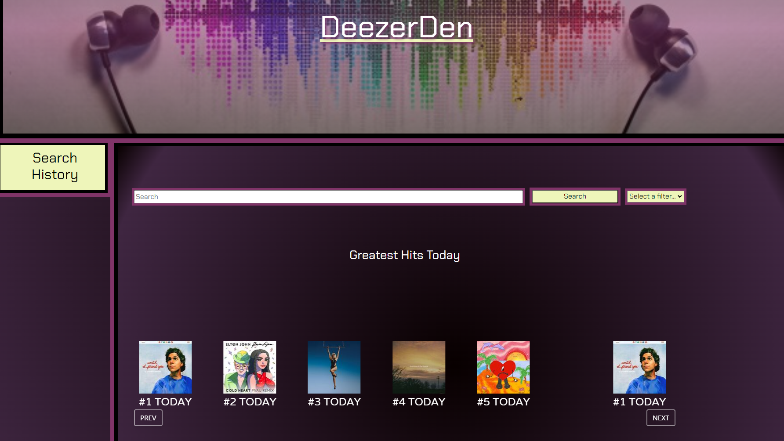

# DeezerDen
This is an application that allows the user to search and access information for artists, albums, and songs and provides them with a link to access that artist, album, or song on deezer.com. 

## Authors

- [@mocha-matcha](https://github.com/mocha-matcha)
- [@cody-and](https://github.com/cody-and)
- [@rweisshaar1](https://github.com/rweisshaar1)
- [@LauerPeter](https://github.com/LauerPeter)

## Tech Stack

- ### Programming Languages
    - HTML: Used to structure the two pages and how the content is displayed.
    - CSS: Used to style the pages so it is pleasant to look at. 
    - JavaScript: Used to operate the search bar and user history.
- ### Programming Languages
    - jQuery: Used to supplement JavaScript to make the code simpler to work with. 
    - Bootstrap: Used to supplement the HTML to make the code simpler to work with. 
    - Glide.js: Used to create showcase items on the home page using JavaScript. 
    - Deezer Music  API: The data that the website uses to conduct its searches and return what the user is looking for. 

## FAQ

#### What is DeezerDen
A: DeezerDen is an application that enables users to easily search and access information about their favorite artists, albums, and songs. It also provides convenient links to access the artists, albums, or songs on deezer.com.

#### Is DeezerDen free to use?
A: Yes, DeezerDen is absolutely free to download and use. There are no hidden charges or subscription fees.

#### Is the content on DeezerDen up-to-date?
A: DeezerDen relies on the information available through its database and the deezer.com API. The app does its best to keep the information current, but there might be occasional delays in updating new releases or changes in the music library.

#### Can I share my favorite artists, albums, or songs with friends?
A: No, unfortunately you can not yet share your search results from DeezerDen with your friends. In the future we hope to implement this feature. 
## Deployment

To deploy this project [click here]((https://mocha-matcha.github.io/group-project1/))

## Screenshots

## Demo

